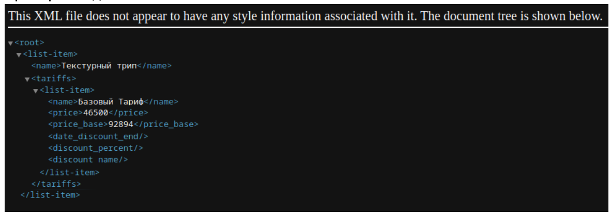

# Задача 

## Описание

Создайте представление, которое выводит все продукты со всеми тарифами, с учетом акций. Вывод должен быть в формате XML, структура произвольная. Акция для тарифа должна выбираться по наибольшему проценту скидки. В представлении должна отображаться информация о дате окончания акции, базовая цена и цена со скидкой (если акция есть).

Модели данных и поля:

- **Product** — имя
- **Tariff** – название, базовая цена, продукт (fk)
- **Promotion** – название, процент скидки, даты начала и окончания, тарифы (m2m)

Технические требования:

- DRF
- PostgreSQL в качестве базы данных.



## Запуск решения

```
docker compose up
./manage.py runserver
```

Можно насоздавать сущностей в админке, и потом увидеть, как продукты отображаются на `http://localhost:8000/easy-html/products/`.

